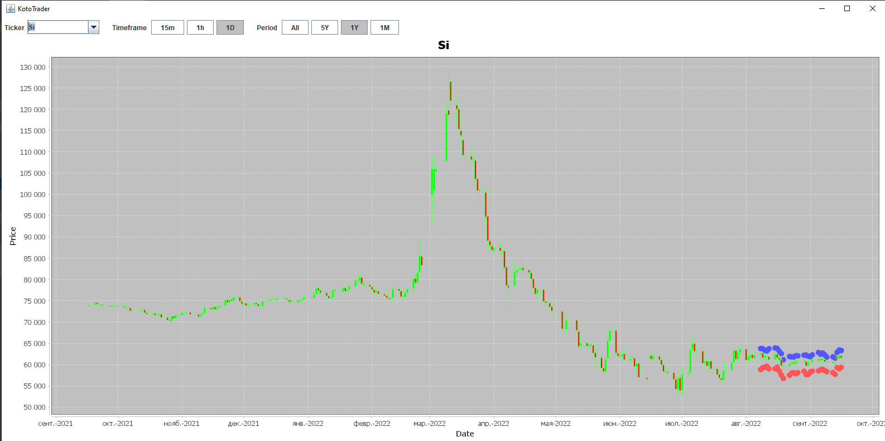

# KotoTrader

KotoTrader is SDK platform for creating trading robots.
You can write robot on Kotlin, download history, simulate your robot on history and finally run your robot with real brokers (Finam, etc).

Download history stock data
--------

Run from Idea class `samples/01DownloadHistory.kt`

Run sample trading robot with Simulator
--------

Run from Idea class `samples/10Simulator.kt`

Run GUI program for see history and robot trades
--------

Run from Idea class `frontend/desktop/KotoTrader.kt`

Run broker-connector to real broker (Finam)
--------

1. Copy `config\terminalConfig-example.json` to `config\terminalConfig.json`.
And insert in `config\terminalConfig.json` login and password fron Finam Transaq Connector.
2. Run from Idea class `samples\20FinamTradingBalance.kt`